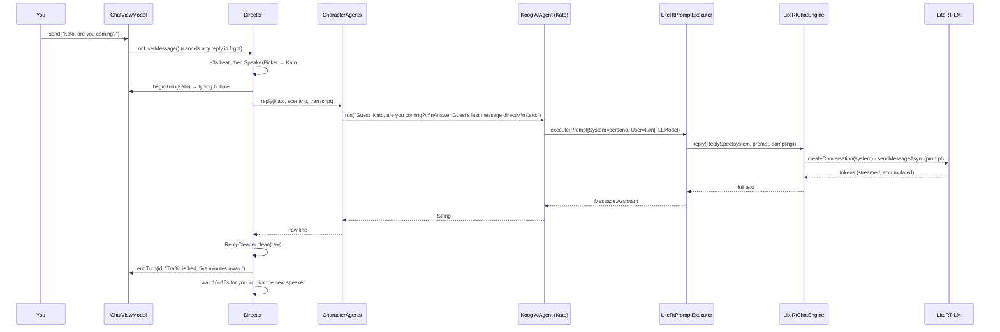

# Banter — architecture

A group chat where every member is a fictional character, each character is a
[Koog](https://github.com/JetBrains/koog) agent, and every agent runs on a language model
stored in the phone. No server is involved at any point.

This document is about how the pieces connect. For what the app does, open it.

## The shape of it

```
┌──────────────────────────── ui ────────────────────────────┐
│  ChatScreen ──▶ ChatViewModel (implements Director.Stage)  │
└───────────────────────────────┬────────────────────────────┘
                                │ transcript, beginTurn / endTurn
┌───────────────────────────── director ─────────────────────┐
│  Director ── SpeakerPicker ── PromptBuilder ── ReplyCleaner│
└───────────────────────────────┬────────────────────────────┘
                                │ Voices.reply(character, scenario, transcript)
┌────────────────────────────── agent ───────────────────────┐
│  CharacterAgents ── one Koog AIAgent per profile           │
│        └── LiteRtPromptExecutor (a Koog PromptExecutor)    │
└───────────────────────────────┬────────────────────────────┘
                                │ ChatEngine.reply(ReplySpec)
┌─────────────────────────────── llm ────────────────────────┐
│  EngineManager ── LiteRtChatEngine ── LiteRT-LM ── .litertlm│
│  ModelStore (import / download / disk)                     │
└────────────────────────────────────────────────────────────┘
```

Each layer only knows the one below it through a small interface: the screen talks to a
`Stage`, the director talks to `Voices`, the agents talk to a `ChatEngine`. That is what let
the agent framework be dropped in without the chat loop or the UI changing.

## One turn, end to end



## Where Koog sits

### One agent per profile — `agent/CharacterAgents.kt`

A character *is* an agent. `CharacterAgents` keeps a `GraphAIAgent<String, String>` per cast
member, built with Koog's convenience factory:

```kotlin
AIAgent(
    promptExecutor = executor,        // our LiteRT bridge, below
    llmModel       = modelFor(character),
    systemPrompt   = PromptBuilder.system(character, scenario),
    temperature    = 0.8,
)
```

The system prompt is the profile from the cast screen — name, what they do, how they talk, who
else is in the chat, what everyone shares, and the secret only this character knows. A persona
is fixed for an agent's lifetime, so agents are keyed by a fingerprint of that prompt and
rebuilt whenever the profile is edited.

Asking a character for a line is `agent.run(turnPrompt)`. Koog builds the `Prompt` (system +
user message), runs its graph, and returns the assistant text. With no tools registered the
graph is a single LLM call, which is exactly what a chat line needs.

`LLModel` is given a custom provider — `LLMProvider("litertlm", "On-device")` — because Koog's
built-in providers are all hosted services. The character's name rides along as the model id
purely so logs say who was speaking; there is only one model file on the device.

### The bridge — `agent/LiteRtPromptExecutor.kt`

Koog reaches a model through `PromptExecutor`. Its shipped executors wrap OpenAI, Anthropic,
Google, Ollama and so on — every one of them a network call. `LiteRtPromptExecutor` is the
same contract pointed at the phone:

| Koog asks for | We do |
|---|---|
| `execute(prompt, model, tools)` | flatten the prompt and generate; return `Message.Assistant` |
| `executeStreaming(...)` | same, emitted as `TextDelta` then `End` |
| `moderate(...)` | throw — there is no moderation model on the device, and inventing a verdict would be worse |

Flattening is the interesting line. Koog hands over a typed list of messages; LiteRT-LM wants a
system instruction and one user turn. Every `Message.System` becomes the system instruction,
everything else is joined into the user turn. Temperature and max-output come from Koog's
`LLMParams` / `LLModel` so the agent config is the single source of truth.

Everything above this file is Koog. Everything below it has never heard of Koog.

## Below the bridge — `llm/`

**`ChatEngine`** is one method: `reply(ReplySpec): Flow<String>`, emitting the reply
cumulatively. `ReplySpec` carries the system prompt, the user prompt, and sampling
(temperature, top-k/p, repetition / presence / frequency penalties, no-repeat n-gram).

**`LiteRtChatEngine`** implements it over LiteRT-LM:

- One `Engine` per process. Loading is seconds and most of the file stays resident, so it is
  created once and kept.
- Generation is CPU-bound and blocking, so every call runs on one dedicated thread behind a
  mutex. Two characters never talk through the runtime at the same time.
- Each reply is its own short-lived `Conversation` carrying the system instruction and sampler
  config. The prompt already contains the little context the app uses, so nothing is worth
  keeping between turns.
- The token stream has carried both deltas and cumulative snapshots across LiteRT-LM versions;
  the collector detects which it got instead of assuming.

**`EngineManager`** owns the lifecycle: it watches `ModelStore` for an installed `.litertlm`,
loads it, exposes `engine` (or `null` when there is nothing to talk to) and an `EngineState`
the UI renders. **`ModelStore`** handles getting the file onto the device — import from the
system file picker, or download with an optional Hugging Face token — with free-space and
metered-network checks.

## Above the bridge — `director/`

**`Director`** is the turn loop, and the only place with opinions about pacing:

- Nobody speaks until the user has. `Voices.ready` false (no model) also means silence.
- After a user message: a 2.5–3.5 s beat, then one character answers.
- After any reply: wait 10–15 s. A user message cuts the wait short; silence lets the next
  character carry on from the last line.
- A reply in flight is cancelled when the user types — it was composed from a transcript that
  did not contain the new message.
- Text is only shown when final. Generation shows a typing indicator, never a half-written
  bubble that might be thrown away.

**`SpeakerPicker`** — the person named in the user's message if any; otherwise anyone but the
last speaker.

**`PromptBuilder`** — the persona (system) and the turn. The turn is the last two messages as
`Name: text` lines, then either `Answer <user>'s last message directly.` when the user spoke
last, or a reminder of the character's own previous line when the characters are talking among
themselves, then `<Name>:` as the completion cue. Two lines of context is deliberate for this
proof of concept.

**`ReplyCleaner`** — what small models get wrong on the way out: keeps only the first line,
strips speaker labels of any kind, rejects a reply that opens with *somebody else's* name (the
model continued the transcript rather than answering), removes stage directions and wrapping
quotes, repairs punctuation glued to the next word, caps length.

**`Voices`** is the seam between director and agents — one interface, one method — so the
director's tests run on a fake with no model and no Koog.

## The screen — `ui/`

`ChatViewModel` owns the transcript and implements `Director.Stage`: `beginTurn` appends a
typing bubble, `endTurn` fills it in or removes it. The loop is started and stopped by the
screen's lifecycle, so the characters fall silent the moment the chat is not on screen.
`CastScreen` edits the profiles that become system prompts; `ModelScreen` drives `ModelStore`.

## Data — `data/`

`Scenario` (title, shared history, the user's display name, cast), `Character` (name, blurb,
quirk, secret), `ChatMessage`. Persisted as two small JSON files. The user's name matters more
than it looks: the transcript is fed to the model as `Name: text`, and a line reading
`You: …` is read by the model as a statement about itself.

## Tests

```bash
./gradlew :app:testDebugUnitTest
```

Concentrated where the behaviour lives: the director's loop on virtual time with fake voices
(silence until spoken to, the beat, the 10–15 s cadence, cancellation), prompt construction,
speaker selection, and reply cleaning.
