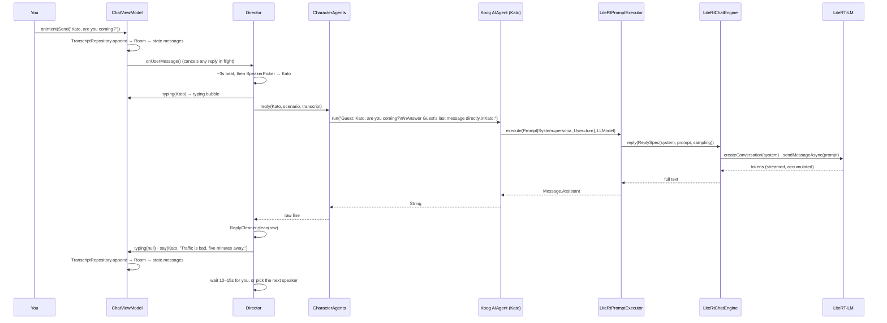

# Banter Android

A group chat where every member is a fictional character, each character is a
[Koog](https://github.com/JetBrains/koog) agent, and every agent runs on a language model
stored in the phone. No server is involved at any point.

This document is about how the pieces connect. For what the app does, open it.

## The shape of it

Three layers, one Gradle module, one package per layer. Dependencies point down only:
`presentation` → `domain` ← `data`. The `di` package is the only place that knows both sides.

```
┌──────────────────────── presentation ────────────────────────┐
│  HomeScreen ─▶ ChatScreen ─▶ ChatViewModel (MVI; Director.Stage)│
│  CastScreen ──▶ (same ViewModel)      ModelScreen ──▶ ModelVM │
└───────────────────────────────┬───────────────────────────────┘
                                │ ScenarioRepository · TranscriptRepository
                                │ EngineRepository · ModelRepository
┌───────────────────────────── domain ─────────────────────────┐
│  Models · Repositories (interfaces) · Voices                  │
│  Director ── SpeakerPicker ── PromptBuilder ── ReplyCleaner   │
└───────────────────────────────┬───────────────────────────────┘
                                │ implemented by
┌────────────────────────────── data ──────────────────────────┐
│  LocalStorage      Room (transcript) · DataStore (scenario)   │
│  ModelRepositoryImpl   files on disk · Retrofit (download)    │
│  LiteRtEngine      LiteRtChatEngine · EngineManager           │
│  CharacterAgents   one Koog AIAgent per profile · executor    │
└───────────────────────────────────────────────────────────────┘
                     di/AppModule: Hilt wiring
```

```
app/src/main/java/com/banter/app
├── BanterApp.kt            @HiltAndroidApp
├── MainActivity.kt         @AndroidEntryPoint
├── di/AppModule.kt         Room, DataStore, OkHttp/Retrofit, Director; @Binds for every interface
├── domain/
│   ├── Models.kt           Character, Scenario, ChatMessage, EngineState, Transfer, Presets
│   ├── Repositories.kt     ScenarioRepository, TranscriptRepository, ModelRepository,
│   │                       EngineRepository, Voices
│   ├── Director.kt         the turn loop
│   ├── SpeakerPicker.kt    who talks next
│   ├── PromptBuilder.kt    persona + turn prompts
│   └── ReplyCleaner.kt     what small models get wrong on the way out
├── data/
│   ├── LocalStorage.kt     Room entity/DAO/database, DataStore serializer, both repositories
│   ├── ModelRepositoryImpl.kt  import from the picker, download via Retrofit, disk checks
│   ├── LiteRtEngine.kt     ChatEngine over LiteRT-LM, EngineManager (EngineRepository)
│   └── CharacterAgents.kt  Voices over Koog agents, LiteRtPromptExecutor
└── presentation/
    ├── BanterRoot.kt       four screens, a `when`, no navigation library
    ├── HomeScreen.kt       pick a group: one coloured tile per scenario
    ├── ChatViewModel.kt    ChatState / ChatIntent / ChatEffect + the ViewModel
    ├── ChatScreen.kt       tinted by the scenario; empty state with opening lines
    ├── CastScreen.kt       edits the scenario through the chat ViewModel
    ├── ModelViewModel.kt   ModelState / ModelIntent + the ViewModel
    ├── ModelScreen.kt
    └── Theme.kt
```

## Screenshots

| Pick a group | Empty chat | Three characters talking |
|---|---|---|
|  |  |  |

Taken on a Pixel emulator with Gemma 4 E2B loaded through LiteRT-LM. Every line from Musa,
Grace and Pastor Ben was generated on the device.

## Screens

The home screen is a grid of tiles, one per scenario, each with its emoji and accent colour. Tapping
one saves it as the current scenario, clears the transcript if the group changed, and opens the chat.
The chat takes the scenario's colour: a wash of it behind the top bar, the user's bubbles filled with
it, the send arrow and icons tinted with it. Before the first message the chat shows who is in the
group and the scenario's opening lines as tappable suggestions. The same shapes, colours and layout
are used by the iOS Banter app, so the two read as one product.

`Scenario` carries `emoji`, `accent` (an index into `AccentPalette`) and `openers` for this. All
three have defaults, so a scenario saved before they existed still loads.

## MVI, as used here

Each screen has one immutable `State`, a sealed `Intent` the screen sends, and (for chat) a
sealed `Effect` for one-shot events such as a snackbar. The ViewModel exposes
`state: StateFlow`, `effects: Flow`, and `onIntent(intent)` — nothing else.

`ChatState` is not stored; it is *derived*: `combine(scenario, transcript, engineState, local)`
where `local` is the little state only this screen owns (auto-chat on/off, who is typing).
Room and DataStore are the source of truth, so a message written by the director shows up on
screen the same way one restored at launch does.

## One turn, end to end



## Domain

Pure Kotlin, no Android, fully unit-tested.

**`Director`** is the turn loop, and the only place with opinions about pacing:

- Nobody speaks until the user has. `Voices.ready` false (no model) also means silence.
- After a user message: a 2.5–3.5 s beat, then one character answers. The beat also gives the
  transcript time to land in Room before the speaker is picked.
- After any reply: wait 10–15 s. A user message cuts the wait short; silence lets the next
  character carry on from the last line.
- A reply in flight is cancelled when the user types — it was composed from a transcript that
  did not contain the new message.
- Text is only shown when final. Generation shows a typing indicator, never a half-written
  bubble that might be thrown away.

It talks to the screen through `Director.Stage` (`transcript`, `typing`, `say`, `onError`)
and to the agents through `Voices` — one interface, one method — so its tests run on fakes
with no model, no Koog, and no database.

**`SpeakerPicker`** — the person named in the user's message if any; otherwise anyone but the
last speaker.

**`PromptBuilder`** — the persona (system) and the turn. The turn is the last two messages as
`Name: text` lines, then either `Answer <user>'s last message directly.` when the user spoke
last, or a reminder of the character's own previous line when the characters are talking among
themselves, then `<Name>:` as the completion cue.

**`ReplyCleaner`** — keeps only the first line, strips speaker labels of any kind, rejects a
reply that opens with *somebody else's* name, removes stage directions and wrapping quotes,
repairs punctuation glued to the next word, caps length.

## Data

**`LocalStorage.kt`** — the transcript is a Room table (`messages`), observed as a `Flow` and
trimmed to the newest 200 rows on every insert. The scenario is a typed DataStore holding one
JSON document, with `Presets.stella` as the default and the corruption fallback.

**`ModelRepositoryImpl`** — import from the system file picker (the path that works for
licence-gated Gemma builds), or download through a one-method Retrofit interface with an
optional Hugging Face bearer token. Both write to `<name>.part` and rename on success, so a
cancelled transfer never looks installed. Free-space and metered-network checks live here.

**`LiteRtEngine.kt`** — `LiteRtChatEngine` runs a `.litertlm` file through LiteRT-LM: one
`Engine` per process, every generation on one dedicated thread behind a mutex, each reply its
own short-lived `Conversation`. `EngineManager` owns its lifecycle and publishes `EngineState`.

**`CharacterAgents.kt`** — a character *is* a Koog agent, keyed by a fingerprint of its system
prompt so an edited profile gets a fresh agent. `LiteRtPromptExecutor` is Koog's
`PromptExecutor` contract pointed at the phone: every `Message.System` becomes the system
instruction, everything else the user turn, sampling comes from the agent's `LLModel`.
Everything above this file is Koog; everything below it has never heard of Koog.

## Dependency injection

Hilt. `AppModule` provides what needs building (Room database, DataStore, OkHttp, Retrofit,
`Director`); `BindsModule` maps each domain interface to its data implementation. ViewModels
are `@HiltViewModel` and reached from Compose with `hiltViewModel()`.

## Tests

```bash
./gradlew :app:testDebugUnitTest
```

Concentrated in `domain`: the director's loop on virtual time with fake voices (silence until
spoken to, the beat, the 10–15 s cadence, cancellation), prompt construction, speaker
selection, and reply cleaning.
